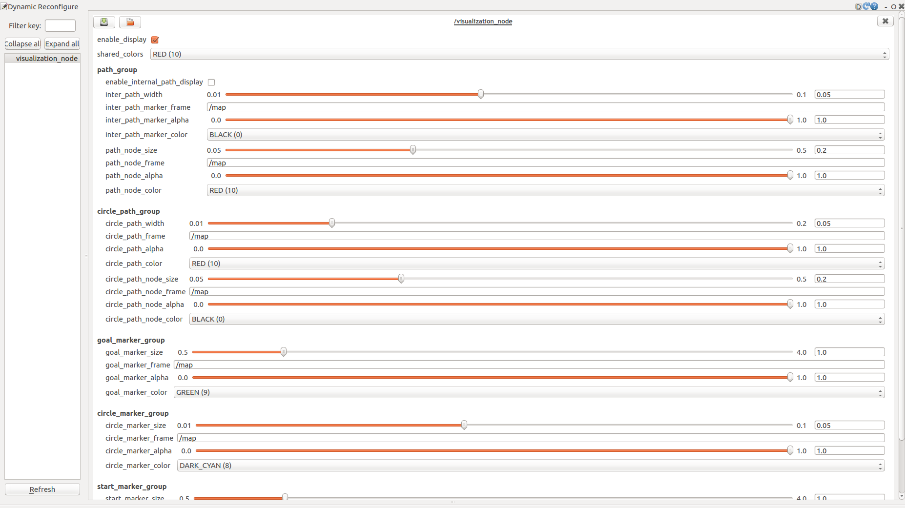

Space Explore Planner
=====================

Overview
--------

This package is an implementation of the space exploration method explained by `Combining Space Exploration and Heuristic Search in Online Motion Planning for Nonholonomic Vehicles`. The post-process is added to generate smooth paths with dense way points using a gradient-free interative optimization algorithm. This package includes two main parts, the space exploration algorithm library and the ros node examples([global path node](https://github.com/bit-ivrc/hmpl/blob/feature_12_space-explore/space_explore/src/global_path_node.cpp)).

Ros Interface of the Global Path Node
-------------------------------------

### Subscribers:

-	`/initialpose` ([geometry_msgs::PoseWithCovarianceStamped](http://docs.ros.org/api/geometry_msgs/html/msg/PoseWithCovarianceStamped.html)\)
-	`/move_base_simple/goal`\([geometry_msgs::PoseStamped]())  

### Publisher:

-	`/modified_path`\([nav_msgs::Path](http://docs.ros.org/api/nav_msgs/html/msg/Path.html)\)
-	`/grid_map`\([nav_msgs::OccupancyGrid]())

### Preloaded Data

-	`obstacle.png`  
	This example node reads the image data as an environment grid map, then plans a path and publishes th grid map.

Example Node
------------

`visualization_node` in `src/visulation_node.cpp`

#### Launch the node

```
roslaunch space_explore visualization_node
```

select a goal in the grid map.

##### Display details of the algorithms

launch `rqt` in another terminal:

```
rqt
```

-	`enable_display` display details if `true`, default:`false`
-	`enable_internal_path_display` display the intermediate optimized paths if `true`, default:`false`
-	Other visualization parameters shown as the figure below. 

**Note**: The changed parameters will change the visualization in the next planning loop.
